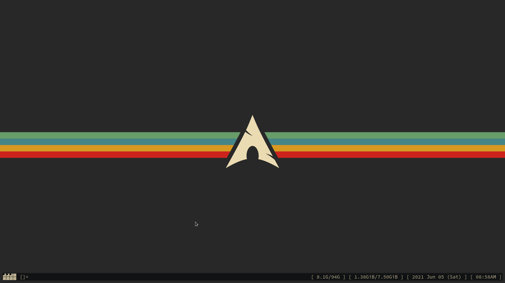
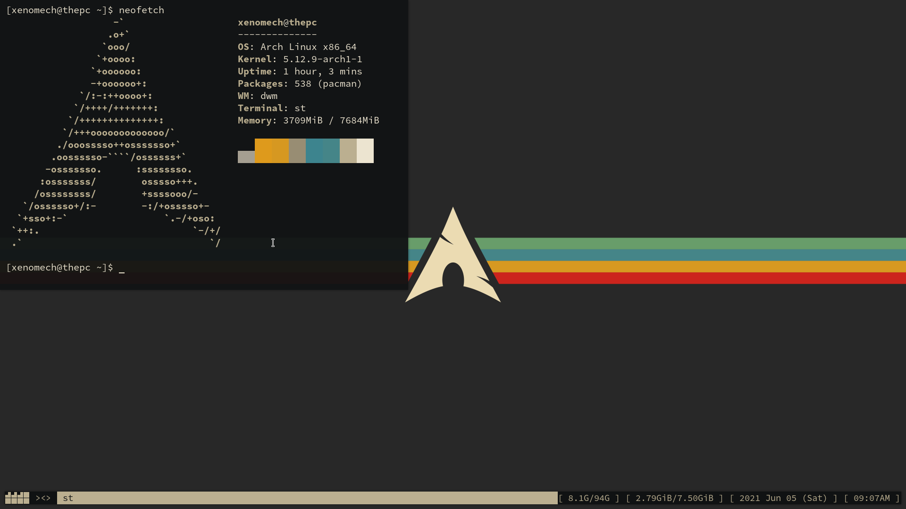
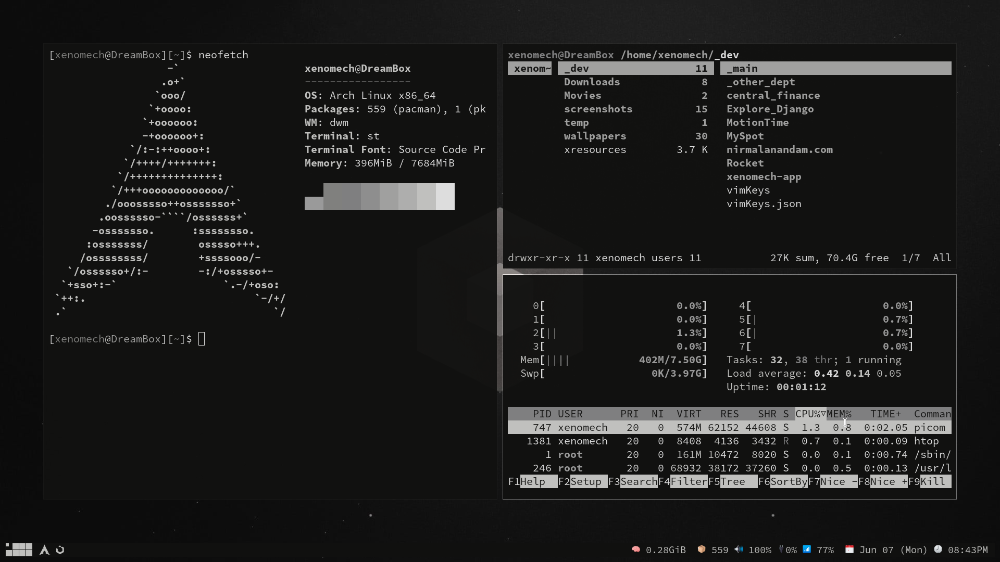

Screenshots
-----------

Grvbox_arch
-----

### Colors : Generated using <a href="https://github.com/dylanaraps/pywal">pywal</a>

### Walpaper : <a href="https://www.reddit.com/r/wallpaper/comments/ll1gov/arch_gruvbox_wallpaper_v2_dark_light_3840x2160/">here</a>

---

 

### Colors : Generated using <a href="https://github.com/dylanaraps/pywal">pywal</a>

### Walpaper : <a href="https://www.wallpaperflare.com/gray-cube-illustration-minimalism-simple-artwork-monochrome-wallpaper-wve">here</a>

---
